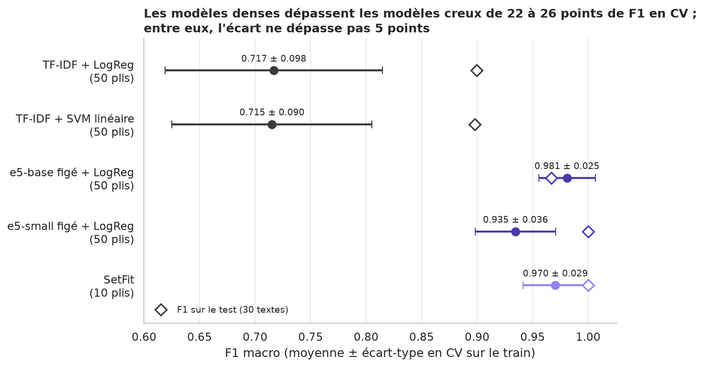
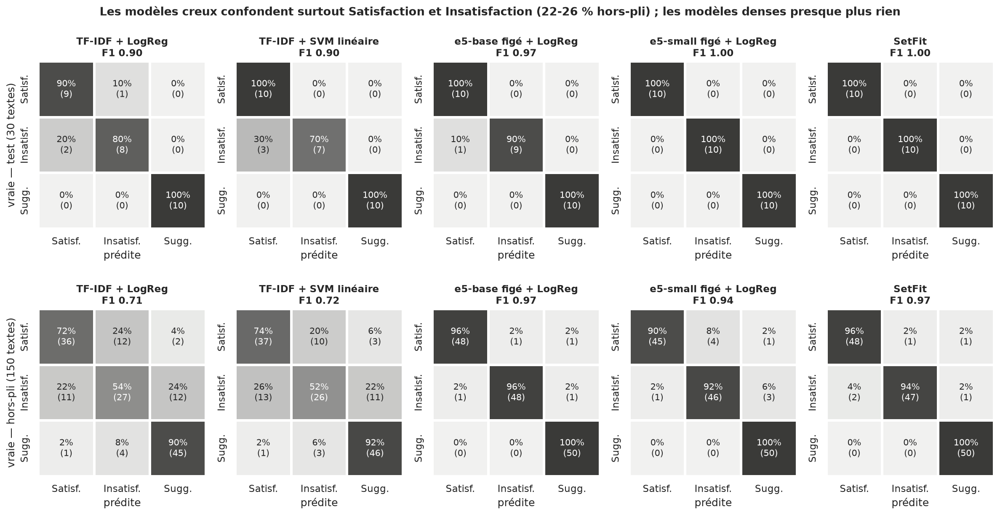

# Classification de commentaires citoyens (TAISS 2026 × Afriklang)

Satisfaction / Insatisfaction / Suggestion sur 150 commentaires français, dont 3 avec de l'éwé.
Application en ligne : **https://afriklang-nlp-citizen.streamlit.app/**

**Approche.** Le nettoyage (minuscules, élisions restituées, accents et lettres éwé conservés, glossaire éwé additif : `akpe` devient `akpe merci`) est dans `preprocessing.py`. Les stopwords NLTK sont amputés de `ne`, `pas` et du conditionnel (`serait`…), qui portent les classes Insatisfaction et Suggestion.
**Choix, chiffrés.** Le split 80/20 stratifié (`random_state=42`) ne laisse que 30 textes de test, soit 3,3 points par erreur : les modèles sont donc choisis par validation croisée 5 plis × 10 répétitions sur le train, et comparés par test de McNemar.
Quatre modèles sont comparés : TF-IDF (mots + caractères) avec régression logistique ou SVM linéaire, `multilingual-e5-base` figé + régression logistique, et SetFit (encodeur affiné). Les stopwords et les n-grammes ne changent rien de démontrable (écarts de 2 à 4 points, pour ± 9 points entre plis).
**Résultats.** TF-IDF + régression logistique : F1 macro 0,717 ± 0,098 en CV ; e5-base figé + régression logistique : 0,981 ± 0,025 en CV et 0,967 sur le test (1 erreur sur 30), retenu. SetFit fait 0,970 pour 37 s de GPU, sans gain. L'écart creux/dense est significatif sur les 150 prédictions hors-pli (McNemar, p ≈ 7·10⁻¹²).
Les erreurs viennent de la négation à sens positif (« je n'ai attendu que 10 minutes »), d'une plainte sans mot négatif et du temps du verbe (« facilite » contre « faciliterait »).
**Déploiement.** e5-base demande 1,56 Go de RAM (TF-IDF : 0,2 Go) : l'application est déployée sur Streamlit Community Cloud (`deploy/streamlit/`, torch CPU), avec TF-IDF en repli.
**Bonus.** CamemBERT fine-tuné : 0,983 ± 0,037 en CV (5 plis appariés), comme e5 figé (0,983 ± 0,023), pour bien plus de calcul. Sur 15 textes mixtes français/éwé relus par un locuteur, le glossaire fait passer e5 de 12 à 13/15 et le TF-IDF de 8 à 11/15. Application Streamlit : classe, probabilités, mots qui ont pesé (occlusion), gloses éwé détectées.
**Limites.** Corpus de 150 textes très « gabarit » (score probablement optimiste), 30 textes de test, 3 textes éwé seulement et glossaire mot à mot sans désambiguïsation ; pistes détaillées dans la section 3 du notebook.





## Reproduire

```bash
uv venv --python 3.12 && source .venv/bin/activate
uv pip install -r requirements.txt     # torch CPU : voir l'en-tête de requirements.txt
jupyter nbconvert --to notebook --execute --inplace analyse_commentaires_citoyens.ipynb   # ~3 min, ou l'ouvrir dans Jupyter
streamlit run app.py                   # démo locale (CPU, ~1,7 Go de RAM avec e5-base)
```

Le notebook télécharge les stopwords NLTK et deux encodeurs Hugging Face au premier lancement. L'entraînement SetFit (GPU) est désactivé par défaut : ses résultats sont relus dans `models/setfit_cv_scores.json`.
